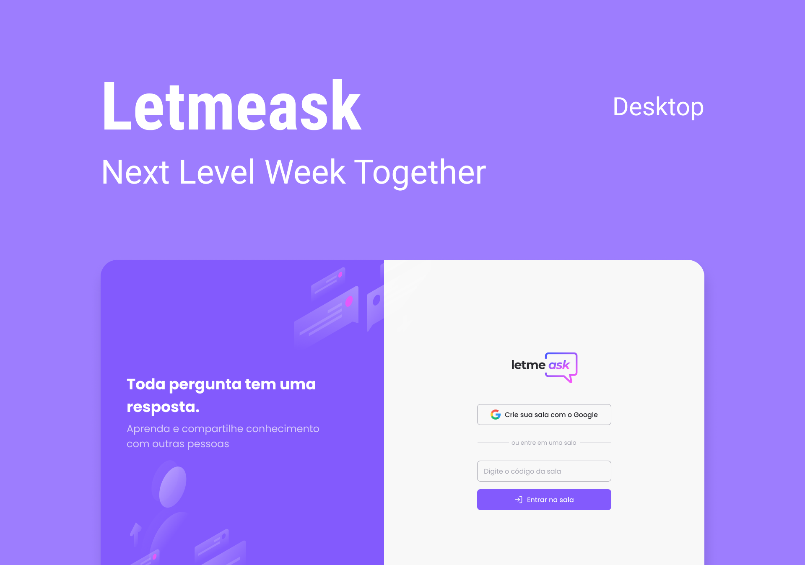

<h1 align="center">
	💡 Letmeask - a NLW6 Application 
	
	
	
</h1>

<h4  align="center">
	"Letmeask" is a open source Q&A app, developed using React and Typescript in the Next Level Week Together event.
</h4>

  

# ℹ️ Description

Letmeask is a application whose aims to help content creators, educators and more, allowing people to create a room with a specific theme and share it, so that more people can submit their own questions to be answered ❗  

This Application has been designed by Rebecca Gonzales, and it was made during the "Next Level Week Together", by Rocketseat.  

# 👩‍💻 Technologies

| Front-end | Back-end |
|--|--|
|ReactJS| Firebase |
|SCSS|  |

# 📜 Scripts

This application has the standard scripts of a Create React App. To run it, use:

### `yarn start`

<h3 align="center">
Made by Vinicius Buchara
</h3>

	

	

