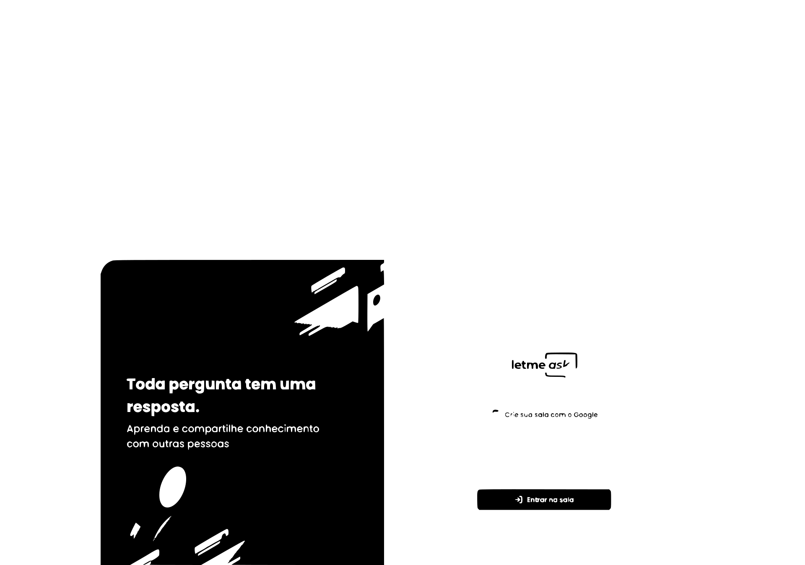

<h1 align="center"> 
	💡 Letmeask - a NLW6 Application 
    
    
    
</h1>

<h4 align="center">
  "Letmeask" is a open source Q&A app, made using React and Typescript in the Next Level Week Together event. 
</h4> 

	

# ℹ️ Description 
<h5>
	⚙️🛠️ Working in progress
</h5>

# 📜 Scripts
<h5>
	⚙️🛠️ Working in progress
</h5>
